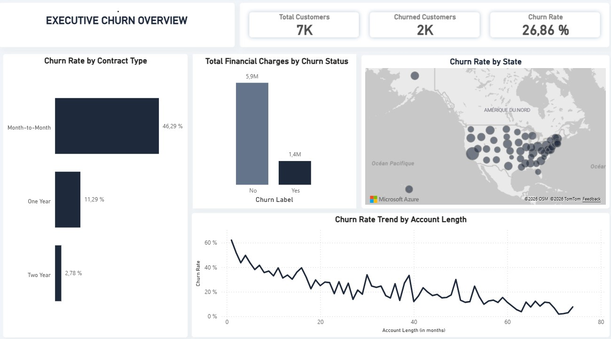
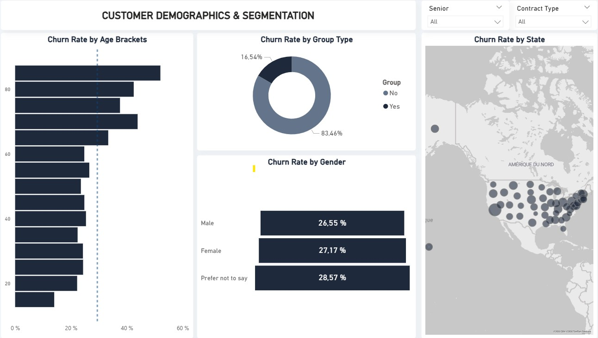
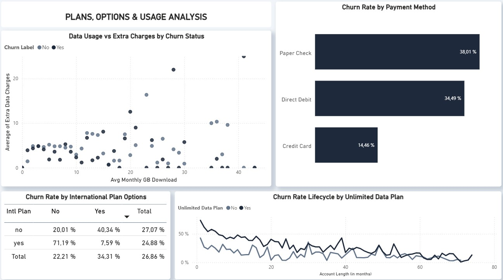
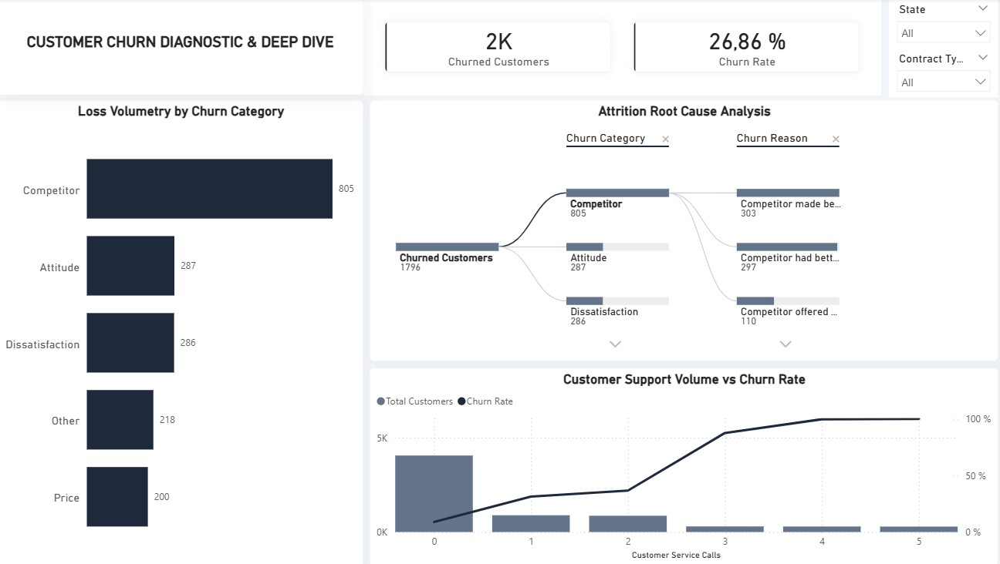

# 📊 Telecom Customer Churn Analysis

An end-to-end Business Intelligence project built to analyze, diagnose, and mitigate customer attrition for **Databel**, a telecom company experiencing a critical churn rate.

---

## 🎯 Project Overview & Objectives

The primary objective of this project is to discover the underlying root causes of customer churn at Databel and provide actionable, data-driven recommendations to management.

By analyzing demographics, contract structures, usage behavior, and customer service interactions, this dashboard highlights why customers leave and defines concrete strategies for retention.

---

## 🏗️ Data Architecture (Kimball Methodology)

The project strictly follows the **Star Schema** dimensional modeling approach to guarantee high query performance and optimal DAX execution speeds.

- **Fact Table:**
  - `Fact_Subscriptions`: Central, narrow table housing ultra-light quantitative metrics (Charges, Minutes, Data consumption, Customer Service Calls).
- **Dimension Tables (1:N relationships via `Customer ID`):**
  - `Dim_Customer`: Demographic profile (Age brackets, Senior status, Gender, Geography).
  - `Dim_Contract`: Billing and subscription options (Contract type, Payment method, Unlimited plans).
  - `Dim_Group`: structural segmentation (Individual vs. Group accounts).
  - `Dim_Churn`: Exclusion and attrition rationale (Churn labels, Categories, Specific reasons).

---

## 🛠️ Tech Stack & Key Deliverables

- **BI Tool:** Microsoft Power BI Desktop
- **Data Modeling:** Power Query (Data cleaning, duplication removal on Primary Keys) & Star Schema Architecture.
- **Calculations:** Advanced DAX (Key Performance Indicators & Conditional Metrics).
- **UI/UX Design:** Modern Minimalist Executive layout (Graphite & Anthracite theme on custom floating background cards).

---

## 📈 Key Business Insights & Analytical Takeaways

Based on the 4-page analysis, several critical operational and commercial pain points were identified:

### 1. Executive Summary (Overview)

- **The Baseline:** Databel faces a substantial **26.86% overall Churn Rate**, meaning more than 1 in 4 customers leave the brand.
- **The Contract Risk:** The primary driver of churn is contract type. **Month-to-month contracts** exhibit an aggressively high attrition rate compared to highly stable 1-year or 2-year subscriptions.

### 2. Attrition Diagnostic (Churn Deep Dive)

- **Competitor Offensives:** The #1 reason customers leave is **Competition** (specifically competitor pricing and better data packages).
- **The Support Threshold:** There is a proven customer frustration ceiling. Customers calling support **3 or more times** have a near 50% probability of immediate cancellation.

### 3. Customer Demographics & Segmentation

- **Age Vulnerability:** **Senior Citizens** display a significantly higher churn rate compared to younger demographics.
- **The Network Effect:** Customers bundled into **Group Plans / Family Plans** are dramatically more loyal, exhibiting a churn rate nearly three times lower than isolated individual subscribers.

### 4. Plans, Options & Usage Analysis

- **The Payment Flaw:** Subscriptions tied to **Paperless / Electronic Check** payments experience abnormally higher drop-outs compared to Direct Debit / Credit Card automatons.
- **International Plan Misalignment:** A critical segment of users pays for the _International Plan_ option but has **0 minutes** of actual international usage, leading to a high sense of poor value and fast cancellation.

---

## 💡 Strategic Recommendations for Databel Management

1.  **Commercial Transition:** Incentivize month-to-month subscribers to transition into 1-year contracts by offering a temporary data bonus or premium discount.
2.  **Proactive Customer Support:** Set up an automated alert system flag inside the CRM for any customer reaching **2 support calls**. The retention team must proactively offer an incentive or discount before the 3rd call occurs.
3.  **Group Offers Drive Retention:** Market aggressive "Family & Friends" acquisition packages. Moving isolated accounts into group plans structurally decreases their churn probability.
4.  **Audit the International Option:** Implement an automated in-app or email prompt targeting customers paying for the International Plan who haven't used it for 60 days, suggesting a smoother, down-scaled billing plan to prevent full contract termination.

---

## 🖥️ Dashboard Architecture & Visuals

The Power BI report is divided into 4 cohesive narrative layers. Below are the design and layout implementations for each page:

### 1. Executive Churn Overview

_High-level summary of financial impacts, geographic losses, and contract risk._

### 2. Customer Demographics & Segmentation

_Exploration of who is leaving across age brackets, group offerings, and gender._

### 3. Plans, Options & Usage Analysis

_Nuance discovery cross-referencing data consumption, payment flows, and option usage._

### 4. Customer Churn Diagnostic & Deep Dive

_Interactive Decomposition Tree tracking exact qualitative reasons and support thresholds._

